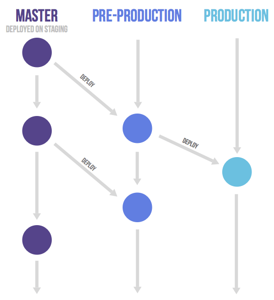

# 🐶 포포체인 🐶 - 믿을 수 있는 동물 의료 기록 추적 서비스

👇[포포체인 소개 및 시연 영상]👇
<br>
https://youtu.be/9AmmoUADeQM


1. [**서비스 소개**](#1)
2. [**기술 스택**](#2)
3. [**개발 환경**](#3)
4. [**프로젝트 진행**](#4)
5. [**프로젝트 산출물**](#5)
6. [**팀원 소개**](#6)
<br>

# Ⅰ. 서비스 소개

## 1. 서비스 설명

### 🐾 포포체인 개요

- 한줄 소개 : `블록체인`을 활용한 동물 의료 기록 관리 및 권리 보호 플랫폼
- 서비스 명 : 포포체인
  - For Paw Chain, 발바닥을 가진 동물들을 위한 블록체인 기반 서비스라는 의미

<br>

## 2. 기획 배경
<br>
1) 현행법상 법적으로 진료기록을 발급할 의무가 없음
<br>
 2) 유기동물이 과거에 어떤 치료를 받았는지 알 수 없음
<br>
 3) 주인이 반려동물의 진료기록을 알 수 없음
<br>
 4) 동물등록제(인식칩)의 의무화
<br>
 5) 중복 치료로 인한 유기동물 동물권 침해
<br>
 6) 의료사고 발생 시 원인 파악 불가능
<br>
 7) 병원 이동 시 불필요한 검사 필요


### ❤ 기획 의도

- `동물권 보장` <br>
    적합한 치료를 받기 어려운 유기동물을 위해 건강 상태를 빠르고 정확하게 파악하여 동물권을 보장
- `동물보호자의 편의성 증진` <br>
    병원에 가지 않아도 모든 보호자가 반려동물의 진료 기록을 확인할 수 있는 편의성 제공 <br>
    병원을 옮길 시 이전의 진료기록 확인 가능
- `투명한 의료기록`<br>
    동물의 의료 기록 투명성을 보장하여 동물병원에 의한 피해를 줄이고, 입양/분양 시 거짓 건강상태로 인한 파양률을 줄임

### 🧡기대효과

`동물보호자`

- 반료 동물의 의료 기록 파악 가능
- 의료 사고 인지 가능
- 반려 동물을 잃어버린 경우, 자신의 정보 공개 가능

`의사`

- 다른 병원에서 치료한 동물이나 유기 동물의 의료 기록 파악 가능
- 성실히 의료 기록을 등록할 경우, 고객으로부터 신뢰성 증가

`동물`

- 유기 동물의 재검사 방지 및 적합한 치료 가능
- 인식칩 사용률 증가
- 동물의 유기 비율 감소

`입양 시`

- 예방 접종 등 사기 방지
- 유기 동물의 입양 장려
- 펫샵 이용률 감소

<br>

## 3. 서비스 화면

### 🤍 로그인

> - 별도 회원가입 없이 카카오 계정을 통해 로그인할 수 있다.
> - 이후 메인페이지로 이동한다.


### 💜 메인페이지

> - 메인페이지에서는 동물등록번호를 입력함으로써 동물 정보와 의료내역을 조회하는 것이 가능하다.
> - 화면을 위로 스크롤 시, `나의 반려동물` 목록을 볼 수 있다.
> - `나의 반려동물` 목록에는 내가 직접 키우는 동물 또는, 의료내역을 열람할 수 있는 권한을 부여받은 동물이 포함된다.
> - [정부 api](https://www.data.go.kr/data/15098913/openapi.do?recommendDataYn=Y)를 이용해 해당 동물의 기본 정보를 같이 조회한다.
> - 의료내역 열람 권한이 없는 유저라면, 의료내역 대신 유기동물 분양 광고를 보여준다.
> - 의료내역 열람 권한이 있는 유저라면, 의료내역 목록을 확인할 수 있다.


### 💜 나의 반려동물 목록

> - 기본적으로는 의사 또는 해당 동물의 주인만이 동물 의료 기록을 열람할 수 있다.
> - 하지만 해당 동물의 주인이 다른 사람에게도 의료 기록을 보여주고 싶은 경우, 열람 권한을 부여할 수 있다.
> - 열람 권한을 다시 뺏을 수도 있다.
> - 키우던 애완 동물을 다른 사람에게 분양 보낼 경우, 분양하기 버튼을 눌러 주인을 변경할 수 있다.


### 💜 동물 등록 정보
> - 해당 동물의 주인이라면, 동물의 추가적인 정보를 직접 입력할 수 있다.


### 💜 의료 기록 조회

> - 의사이거나, 해당 동물의 주인이거나, 그 밖에 열람 권한을 따로 부여받은 사람이라면, 해당 동물의 의료 기록들을 조회할 수 있다.
> - 동물마다 1개의 컨트랙트가 블록체인 네트워크에 배포된다.
> - 의료 기록은 해당 동물의 컨트랙트에 저장된다.
> - 컨트랙트의 배포 및 조회, 작성은 모두 Web3j를 통해 이루어진다.


### 💜 QR코드 생성

> - 10자리가 넘는 긴 동물등록번호를 매번 기억하기 어려운 사용자들을 위해, QR 이미지를 제공한다.
> - QR 이미지는 휴대폰 갤러리에 저장할 수 있다.


### 💜 권한 관리


### 💜 입양 공고


### 💜 의사 면허 인증


### 💜 의료 기록 작성

> - 본인이 의사임을 인증하면, 수의사로서 동물의 의료내역을 작성할 수 있는 권한이 부여된다.
> - 본인이 의사임을 인증하는 방법은 보건복지부의 [의료인면허정보조회](https://dataapi.co.kr/upload/dLab/20220105-173345-00330.html) api를 이용한다.


  <br>

<div id="2"></div>

# Ⅱ. 기술 스택

## 1. 블록체인 네트워크
>- 기능: 지갑 생성, 컨트랙트 배포, 트랜잭션 전송
>- 구현: EC2 서버에서 geth를 이용하여 gensis.json으로 초기화하는 방식으로 가능한 네트워크 구성 
<br>

## 2. IPFS
>- 기능: 이미지를 분산 네트워크에 저장하고, 반환하는 해쉬값을 이용하여 이미지를 조회
>- EC2 서버에 존재하는 Docker 위에 kudo ipfs 실행
<br>

## 3. Android
>- 언제 어디서나 의료기록을 확인할 수 있도록 모바일 환경에서의 서비스 선택
>- 편하게 등록번호를 공유하기 위해 QR 기능을 제공
<br>

<div id="3"></div>

# Ⅲ. 개발 환경 🖥️

## 🖥 Backend


## 🖥 Frontend


## 🖱 DevOps


## 🎨 UI/UX


## 👨‍👩‍👧 협업 툴


## 블록체인


## 버전 정보

### Server

- Server: `AWS EC2`
- Ubuntu: `20.04`
- Docker: `23.0.2`
- Nginx: `1.18.0`
- Redis: `7.0.10`
- MariaDB: `10.3.38`

### Back-end

- OpenJDK: `11`
- Build Tool: `Gradle`
- Spring Framework: `2.7.9`
- Spring Dependency-management: `1.0.15.RELEASE`

### Front-end

- Kotlin: `1.8.0`
- Java: `11`
- Compile SDK: `33`
- Room Runtime: `2.3.0`
- Palette: `1.0.0`
- navigation-safe-args-gradle-plugin: `2.5.3`
- retrofit : `2.6.4`
- QR: `3.4.1`
- glide: `4.12.0`
- room-runtime: `2.3.0`
- kakao.sdk: '2.13.0'

### 블록체인

- Geth: `1.11.5`
- web3j: `4.9.7`
- Solidity: `latest`

### IDE

- InteliJ: `2022.3`
- Android Studio: `2022.1`
- Emulator: `Pixel 2 XL`

### Management Tool

- 형상 관리: `GitLab`
- 이슈 관리: `JIRA`
- 커뮤니케이션: `Notion`
- 파일 저장: `Spring Cloud GCP Storage`
- UI/UX 디자인: `Figma`

<br>
<div id="4"></div>

# Ⅳ. 시작하기

아래 방법을 따라 프로젝트를 실행할 수 있습니다.

## 설치하기

### 설치 과정

1. Github의 Repository를 clone합니다.

```java
$ git clone [우리 주소]
```

2. APK 파일 생성을 참고하여 android 폴더를 APK로 생성하여 안드로이드 환경에 설치합니다.

### APK 파일 생성

1. Android Studio의 `Build > Generate Signed Bundle / APK ...`를 선택합니다.
2. Create new를 선택합니다.
3. Key Store Path를 설정합니다.

```java
Alias: 기본
Password: (6자) / Confirm 
Certificate: 앱에 대한 메타 데이터 넣기
```

4. release 선택합니다.
5. 카카오 로그인 관련 내용을 설정합니다.
    1. openssl로 release key와 debug key를 모두 발급 받은 후 카카오 디벨로퍼에 등록합니다.
    2. 참고: [https://ranseo.tistory.com/m/386](https://ranseo.tistory.com/m/386)
6. err_unknown_url_scheme 에러가 발생하는 경우 AndroidManifest.xml에서 
Native app key를 넣고 아래의 설정을 추가합니다.

```java
<activity
            android:name="com.kakao.sdk.auth.AuthCodeHandlerActivity"
            android:exported="true">
            <intent-filter>
                <action android:name="android.intent.action.VIEW" />
                <category android:name="android.intent.category.DEFAULT" />
                <category android:name="android.intent.category.BROWSABLE" />

                <!-- Redirect URI: "kakao${NATIVE_APP_KEY}://oauth" -->
                <data android:host="oauth"
                    android:scheme="kakaoa본인카카오native key" />
            </intent-filter>
</activity>
```

## 실행하기

1. AWS EC2 설정을 참고하여 AWS EC2에 접속합니다.
2. Jenkins 설정을 참고하여 Back-end 이미지를 생성합니다.
3. IPFS Image를 설치하고 실행합니다.
4. 네트워크 설정을 참고하여 블록체인 private 네트워크를 구축하고 실행합니다.
5. 저장소 설정을 참고하여 MariaDB, Redis, GCP를 설치하고 서버 주소와 연결합니다.
6. 첨부한 덤프 데이터 파일을 이용하여 데이터를 생성합니다.
7. 설치한 APK를 실행합니다.

### AWS EC2 설정

```java
remote host: j8a207.p.ssafy.io
username: ubuntu
.pem: 첨부 파일
```

### Jenkins 설정

1. Repository URL을 통해 Git 프로젝트를 연결합니다.
2. Git의 WebHook 설정을 통해 release branch의 push event를 감지하면 자동으로 프로젝트를 배포하도록 설정합니다.
3. Shell Script를 Jenkins의 Build Steps에 Execute하여 자동으로 빌드하도록 설정합니다.

```java
cd backend/
chmod +x ./gradlew
./gradlew clean build
```

4. Shell Script를 Jenkins의 Build Steps에 Execute하여 Docker Image를 자동으로 생성하도록 설정합니다.

```java
docker build -t backend ./backend
if (docker ps | grep backend) then docker stop backend; fi
docker run -d --rm --name backend --network my-network -p 8080:8080 backend
docker image prune -f
```

5. 프로젝트 내부에 Dockerfile을 생성합니다.

```java
# open jdk java 11 버전 환경
FROM openjdk:11-jdk

# gradle 빌드 시 jar 파일 생성 경로
ARG JAR_FILE=./build/libs/*.jar

# JAR_FILE을 메인 디렉토리에 복사
COPY ${JAR_FILE} app.jar

# 8080 port Open
EXPOSE 8080

# 시스템 진입점
ENTRYPOINT ["java","-jar","app.jar"]
```

### IPFS 설정

1. IPFS Docker Image를 설치합니다.

```java
docker pull ipfs/go-ipfs
```

2. Run 명령어를 통해 IPFS Image를 실행합니다.

```java
docker run \
 -d \
--restart always \
--name ipfs-node \
-v /data/ipfs:/data/ipfs \
-v /data/ipfs-staging:/staging \
-p 8001:8080 \
-p 4001:4001 \
-p 5001:5001 \
--network my-network \
ipfs/go-ipfs:latest \

docker exec ipfs-node ipfs config Addresses.API 127.0.0.1/8001
```

### 네트워크 설정

1. Geth를 설치합니다.

```java
sudo apt-get update
sudo apt-get install software-properties-common
sudo add-apt-repository -y ppa:ethereum/ethereum
sudo apt-get install
```

2. 블록체인 네트워크 폴더를 생성 후 이동합니다.

```java
mkdir eth
cd eth
```

3. ether를 채굴할 계정을 생성합니다.

```java
geth --datadir . account new
```

4. genesis.json 파일을 생성합니다.

```java
{
	"config": {
	"chainId": 7167, 
	"homesteadBlock": 0, 
	"byzantiumBlock": 0, 
	"constantinopleBlock": 0, 
	"eip150Block": 0, 
	"eip155Block": 0, 
	"eip158Block": 0 
	},
	"difficulty": "0x10", 
	"coinbase": "지갑주소", 
	"gasLimit": "9999999", 
	"alloc": {}, 
	"extraData": "", 
	"nonce": "0xdeadbeefdeadbeef", 
	"mixhash": "0x0000000000000000000000000000000000000000000000000000000000000000", 
	"parentHash": "0x0000000000000000000000000000000000000000000000000000000000000000", 
	"timestamp": "0x00"
}
```

5. 네트워크를 초기화합니다.

```java
geth --datadir . init genesis.json
```

6. 초기화한 네트워크를 실행합니다. 

```java
geth --datadir . --port 30303 --http --http.addr "0.0.0.0" --http.port 8545 --http.corsdomain "*" --networkid 7167 --http.api "admin,db,eth,debug,miner,net,shh,txpool,personal,web3" --unlock 0 --allow-insecure-unlock --mine --miner.threads 1 --miner.etherbase "지갑주소" console 2>>./geth.log
```

7. application.properties에 구축한 네트워크를 설정합니다.

```java
web3.network.address=[blockchain private network address]
web3.network.chainId=[blockchain private network chain id]
web3.walletPrivateKey=[private key of server's wallet]
```

### 저장소 설정

1. AWS EC2 환경에 MariaDB를 설치하고 MariaDB의 root 계정으로 프로젝트의 DB를 생성합니다. 필요에 따라 프로젝트만의 계정을 생성하여 사용할 수 있습니다.

```java
$ sudo apt=get install mariadb-server

$ sudo systemctl start mariadb
$ sudo systemctl status mariadb

$ sudo mysql -u root

MariaDB [mysql]> CREATE DB [DB 이름]
```

2. application.properties의 DB 주소를 MariaDB가 설치된 AWS EC2로, JPA 설정을 create로 변경하고 프로젝트를 실행합니다.

```java
spring.datasource.url=jdbc:mariadb://[DB 주소]/[DB 이름]
spring.datasource.username=[DB 계정 이름]
spring.datasource.password=[DB 계정 비밀번호]

spring.datasource.driver-class-name=org.mariadb.jdbc.Driver

spring.jpa.hibernate.ddl-auto=create
spring.jpa.hibernate.naming.physical-strategy=org.hibernate.boot.model.naming.PhysicalNamingStrategyStandardImpl
```

3. application.properties의 JPA 설정을 update로 변경하고 첨부한 덤프데이터 sql을 실행합니다.

```java
spring.jpa.hibernate.ddl-auto=update
```

4. AWS EC2 환경에 Redis를 설치하고 비밀번호를 설정합니다.

```java
$ sudo apt-get install redis-server

$ sudo vi /etc/redis/redis.conf
bind 0.0.0.0
daemonize yes // default == no
logfile /var/log/redis_6379.log
dir /var/redis/6379

$ sudo service redis-server start

$ redis-cli

redis 127.0.0.1:6379> CONFIG SET requirepass "비밀번호"
redis 127.0.0.1:6379> AUTH "비밀번호"

$ sudo systemctl restart mariadb
```

5. application.properties의 Redis 주소를 Redis가 설치된 주소로, 비밀번호를 직접 설정한 비밀번호로 변경합니다.

```java
spring.redis.host=[Redis 설정 주소]
spring.redis.port=[Redis 설정 포트]
spring.redis.password=[Redis 설정 비밀번호]
```

6. GCP 공식 사이트에서 프로젝트에 사용할 Storage를 생성하고, Storage의 정보를 json 파일을 통해 프로젝트에 설정합니다.

```java
spring.cloud.gcp.credentials.location=classpath:[json 파일 위치]
spring.cloud.gcp.storage.project-id=[GCP 설정 ID]
spring.cloud.gcp.storage.bucket=bucket-img-id=[GCP 설정 ID]
```

```java
{
  "type": "service_account",
  "project_id": "project_id",
  "private_key_id": private_key_id",
  "private_key": "private_key",
  "client_email": "client_email",
  "client_id": "client_id",
  "auth_uri": "auth_uri",
  "token_uri": "token_uri",
  "auth_provider_x509_cert_url": "auth_provider_x509_cert_url",
  "client_x509_cert_url": "client_x509_cert_url"
}
```
<br>

# V. 프로젝트 진행

## 🕑 프로젝트 진행 기간
2023.02.20(월) ~ 2023.04.07(금) (47일간 진행) 
<br>
SSAFY 8기 2학기 특화 프로젝트
<br>

## 1. git



## 2. Jira

매주 월요일 오전 회의에서 차주에 진행되어야 할 것들을 정리하고 백로그에 등록했습니다. 금주에 완료하지 못한 이슈나, 앞으로 진행할 이슈들을 추가했습니다.

`에픽(epic)`은 구현하고자 하는 기능을 기준으로 구성하였습니다. (예: 권한 관리, 블록체인 등)

실질적인 작업 결과물이 나오는 업무는 `작업(task)`으로, 그렇지 않은 업무는 `스토리(story)`로 할당하였습니다.

마지막으로 담당자와 스토리 포인트 설정, 활성 스프린트에서 현재 업무의 진행에 따라 할 일, 진행중, 완료 실시간으로 반영하는 것을 가장 중요하게 생각했습니다.


## 3. Notion

팀원들이 모두 공유해야할 자료 및 링크를 노션에 정리했습니다. API 설계, ERD, 컨벤션와 같이 여러번 다시 봐야하고 중요한 정보들을 공유하였습니다.

달력을 만들어 활용함으로써 중요한 일정은 잊지 않고 챙길수 있게끔 하였습니다.


<br>

<div id="5"></div>

# VI. 프로젝트 산출물

## 🏛 서비스 아키텍처


## 🎨 화면 설계서

<a href="">
    
</a>
<a href="">
    
</a>

## 🛢︎ ERD


## 📜 API 설계서

<a href="">
    
</a>

<br>

<div id="6"></div>

# VII. 팀원 소개


